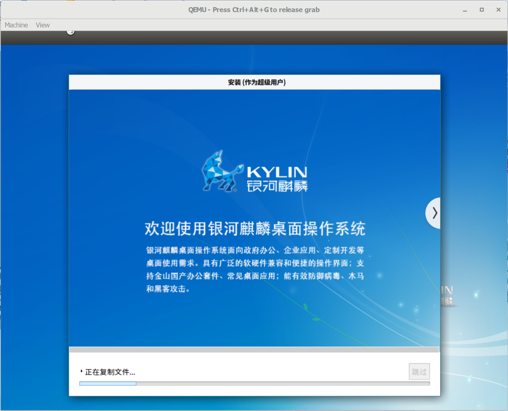

## windows 环境 qemu 安装 Kylin_arm64

#### 准备相关文件
EFI：
```
https://releases.linaro.org/components/kernel/uefi-linaro/latest/release/qemu64/QEMU_EFI.fd
```
系统镜像：
```
Kylin-Desktop-V10-Release-Build1-20200710-arm64.iso
```

#### 创建img
```
E:\VM\qemu\qemu-img.exe create E:\VM\qemu_img\kylinDesktop_arm64.img 60G
```

#### 安装镜像
```
E:\VM\qemu\qemu-system-aarch64.exe -m 4096 -cpu cortex-a72 -smp 2,cores=2,threads=1,sockets=1 -M virt -bios E:\VM\qemu_img\QEMU_EFI.fd -net nic,model=pcnet -device nec-usb-xhci -device usb-kbd -device usb-mouse -device VGA -drive if=none,file=E:\VM\Kylin-Desktop-V10-Release-Build1-20200710-arm64.iso,id=cdrom,media=cdrom -device virtio-scsi-device -device scsi-cd,drive=cdrom -drive if=none,file=E:\VM\qemu_img\kylinDesktop_arm64.img,id=hd0 -device virtio-blk-device,drive=hd0
```
###### 参数详解
|qemu-system-aarch64|二进制文件，提供模拟aarch64架构的虚拟机进程
|--|--|
|-m 4096|分配2048MB内存|
|-cpu cortex-a72|模拟成什么CPU，其中cortex-a53\a57\a72都是ARMv8指令集的|
|-smp 2,cores=2,threads=1,sockets=1|2个vCPU，这2个vCPU由qemu模拟出的一个插槽（socket）中的2个核心，每个核心支持一个超线程构成。|
|-M virt|模拟成什么服务器，我们一般选择virt就可以了，他会自动选择最高版本的virt|
|-bios xxx|指定bios bin所在的路径|
|-net|添加网络设备|
|-device xxx|添加一个设备，参数可重复|
|-drive|添加一个驱动器，参数可重复|

#### 启动镜像
```
E:\VM\qemu\qemu-system-aarch64.exe -m 4096 -cpu cortex-a72 -smp 2,cores=2,threads=1,sockets=1 -M virt -bios E:\VM\qemu_img\QEMU_EFI.fd -device nec-usb-xhci -device usb-kbd -device usb-mouse -device VGA -device virtio-scsi-device -drive if=none,file=E:\VM\qemu_img\kylinDesktop_arm64.img,id=hd0 -device virtio-blk-device,drive=hd0
```
#### 示例图
```
 或 
```
